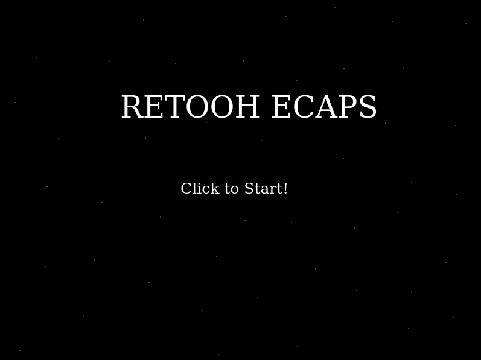

[](https://lbesson.mit-license.org/)
[](http://makeapullrequest.com)
[](https://github.com/ellerbrock/open-source-badges/)


# Retoohs-Ecaps

## Background

It's the year 3000! The planet **Retoohs Ecaps** is under attack from the **Envoy**, an alien race seeking to colonise your galaxy. You're the last remaining Starship. Can you prevent an all out invasion?

## Aim of the game

Attain a top 10 score to save your planet! **Your score** will be only be displayed on the leaderboard if it falls within the top ten warlord scores.

## Scenes

The game is split into five scenes:

- a Boot scene for initial startup
- a Preload scene for loading game assets
- a Title or start game scene
- a Game scene where the action takes place
- and a Leaderboard scene for displaying the top 10 scores

## MVP Features

- Start Game
- Move player in all four directions horizontally and vertically
- Spawn enemies
- Enemy lasers
- Player lasers
- Destroy enemy ships
- End game for player
- Score system

## Nice-to-haves for future implementation

- Ship explosion animation on impact with lasers
- Game sounds and music
- Additional scenes for Settings, Credits, etc
- Mobile compatible version

## Controls

- `SPACE` = PLAYER LASER
- `LEFT ARROW` = MOVE LEFT
- `RIGHT ARROW` = MOVE RIGHT
- `UP ARROW` = MOVE UP
- `DOWN ARROW` = MOVE DOWN



## :tv: Media

[Live Demo Link](https://rawcdn.githack.com/cliftondavies/Retoohs-Ecaps/a1e33f9a683b885e7d901e628ad677e1a4627742/build/index.html)

## :toolbox: Tools & Technologies Used

### Built with

- HTML5
- JavaScript ES6
- [Phaser](https://phaser.io/)
- Fetch API
- Leaderboard API
- webpack 5

### Tested with

- Jest v26.6

## :rocket: Getting Started

To get a local copy up and running follow these simple example steps.

### Prerequisites

Install [Node.js with npm](https://nodejs.org/en/download/)

Install [webpack](https://webpack.js.org/guides/getting-started/)

### Set up

Clone repo into your local environment:

Clone with SSH

```git
git clone git@github.com:cliftondavies/Retoohs-Ecaps.git
```

Clone with HTTPS

```git
git clone https://github.com/cliftondavies/Retoohs-Ecaps.git
```

Open project directory

```bash
cd [your-directory-name]
```

Install packages:

```javascript
npm install
```

### Local Usage

#### In console

Start server:

```javascript
npm run start:dev
```

Run tests:

```javascript
npm test
```

#### In Browser

Visit `http://localhost:8080/`.

## Author

👤 **Clifton Davies**

- Github: [@githubhandle](https://github.com/cliftondavies)
- Twitter: [@twitterhandle](https://twitter.com/cliftonaedavies)
- Linkedin: [linkedin](https://www.linkedin.com/in/clifton-davies-mbcs/)

## 🤝 Contributing

Contributions, issues and feature requests are welcome!

## Show your support

Give a ⭐️ if you like this project!

## Acknowledgements

- [CruzR](https://opengameart.org/content/space-starter-kit)

## 📝 Copyright & License

Copyright (c) 2020 Clifton Davies.
This project is licensed under [MIT](https://opensource.org/licenses/MIT). See LICENSE file for details.
